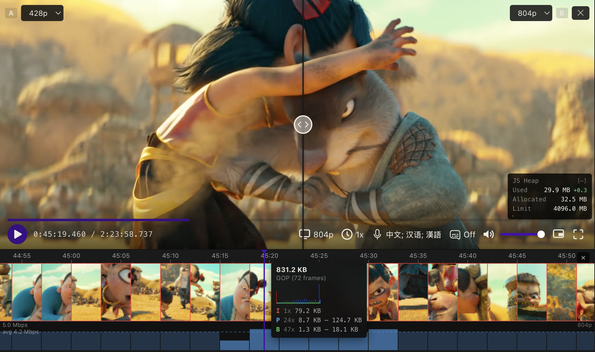

# R&D Player

A browser-based video player and stream analyzer for DASH and HLS. Paste a manifest URL and get a professional inspection toolkit — quality comparison with VMAF/SSIM metrics, frame-level filmstrip analysis, loudness metering, multi-track subtitles with AI translation, and scene detection. No install, no desktop app, runs entirely in the browser.

**[Live demo](https://openipc.github.io/rnd-player/)**



---

## For QC & Encoding Engineers

**Quality comparison with objective metrics** — load two manifests (or two renditions of the same stream) side by side with frame-accurate sync. Switch between split view, toggle/flicker, and diff overlays. Diff mode renders PSNR, SSIM, MS-SSIM, and VMAF heatmaps on the GPU, with amplification (1×–8×) and real-time metric readouts. Draw a spotlight rectangle to auto-zoom into a region of interest. Share the exact view state — zoom, pan, slider position, palette, highlight — via a single URL.

**Filmstrip timeline with frame-level zoom** — scroll through the stream as a visual strip of decoded thumbnails. Zoom in to see individual frames with color-coded borders: red for I-frames, blue for P, green for B. Hover over the bitrate graph to inspect GOP structure with per-frame byte sizes. Save any frame at full resolution via right-click — decoded from the active rendition, not the thumbnail stream.

**Per-segment bitrate graph** — measured from actual network responses, not manifest estimates. See bitrate spikes, CBR consistency, and encoder reactions to scene changes. Measured segments shown in solid color, estimated in lighter shade.

**EBU R128 loudness metering** — momentary (400 ms), short-term (3 s), and integrated LUFS with BS.1770-5 K-weighting. True Peak via 4× oversampled sinc interpolation. Loudness Range (LRA) per EBU Tech 3342. Switchable targets: Spotify/YouTube (−14), Apple Music (−16), EBU R128 (−23), ATSC A/85 (−24), Cinema (−27).

**Scene detection** — load av1an scene data (JSON) via URL parameter, file picker, or drag-and-drop. Scene boundaries appear as orange markers on both the filmstrip and progress bar. Hover near a boundary to see before/after frame previews; click to seek. Navigate scenes with PageUp/PageDown. Generate a download script from the right-click menu to curl all segments and run av1an locally.

**Stats panel** — codecs, resolution, frame rate, dropped frames, buffer health, network throughput, color gamut, and more. One right-click away.

## For Language Learners

**Multi-track subtitles** — display multiple subtitle tracks simultaneously, each color-coded from a 9-color palette. Drag any track to your preferred vertical position (persisted across sessions). Toggle individual tracks with number keys 1–9, or all at once with C.

**Click to copy** — single-click a subtitle to copy its text. Ctrl+C / Cmd+C copies all visible cue text across tracks. Long-press a subtitle to open a context popup with surrounding dialogue (3 cues before and after) — release to copy the full context.

**AI-powered translation** — hover a subtitle to reveal the translate button. Translates via OpenAI-compatible API (GPT-4o-mini by default, or any local endpoint) with color-coded word alignment: corresponding word groups in source and translation share the same color, so you can see exactly which words map to which. Supports any source/target language pair.

## For Developers

**Modular architecture** — 10 optional feature modules (filmstrip, quality compare, stats, audio levels, subtitles, segment export, adaptation toast, keyboard shortcuts, sleep/wake recovery, scene markers), each independently toggleable at runtime. Three build presets strip unused code at compile time:

| Preset | Command | What's included |
|--------|---------|-----------------|
| Full | `npm run build` | Everything — all analysis tools |
| Production | `npm run build:production` | Core player + playback features |
| Minimal | `npm run build:minimal` | Bare player with controls only |

**Automatic capability detection** — on first load, probes WebCodecs, WebGL2, Web Audio, Workers, OffscreenCanvas, and hardware specs. Low-end devices get heavy modules disabled automatically. Users can override any toggle in Settings.

**Component integration** — built with React 19 + TypeScript + Vite. The `ShakaPlayer` component accepts a manifest URL, optional ClearKey hex, module config, and scene data as props. Module config can be passed programmatically to control which features are active.

**Cross-browser DRM** — auto-detects ClearKey DRM from DASH manifests. On browsers where EME silently fails (macOS WebKit) or is absent (Linux WebKitGTK), falls back to software AES-128-CTR decryption transparently. Filmstrip, frame export, and boundary previews all work on encrypted content.

**Codec coverage** — H.264, HEVC/H.265, AV1, VP9. Adaptation toast shows codec names when they change during ABR switches.

**CORS handling** — three-tier fetch strategy (direct → cache-bust workaround → optional HMAC-authenticated proxy) handles cross-origin CDN requests without server-side changes.

---

## Core Player Features

- **ABR adaptation toast** — two-phase notification (pending → confirmed) when the player switches quality. Shows old/new resolution, bitrate, and codec. Green for upgrades, amber for downgrades.
- **Clip export** — set in/out points with I/O keys, pick a rendition, and download the segment as MP4.
- **Keyboard-driven workflow** — J/K/L shuttle (up to 16×), frame-step with ←/→ or comma/period, volume, fullscreen, scene navigation. Press ? for the full shortcut reference.
- **Sleep/wake recovery** — detects system sleep via timer-gap analysis and `visibilitychange`, then restores playback position automatically.
- **Shareable URLs** — every player state (time with ms precision, quality, compare mode, zoom, highlight, scene data) is serializable to URL parameters.

Works with any public DASH (.mpd) or HLS (.m3u8) stream. No server required.

## Browser Support

Automatically tested on every commit:

| Chromium · Linux | Firefox · macOS | WebKit · Linux |
|:---:|:---:|:---:|
|  |  |  |

| Safari · macOS | Edge · Windows |
|:---:|:---:|
|  |  |

### Codec support matrix

Results reflect what passes the E2E test suite on CI. Filmstrip column covers WebCodecs decode (required for frame thumbnails).

| Browser | OS | H.264 | HEVC | AV1 | Filmstrip | ClearKey DRM |
|---------|-----|:-----:|:----:|:---:|:---------:|:------------:|
| Chromium | Linux | ✅ | ❌ | ✅ | ✅ | ✅ |
| Firefox | Linux | ✅ | ❌¹ | ✅ | ✅ | ✅ |
| WebKit (GTK) | Linux | ✅ | ✅ | ✅² | ✅ | ✅³ |
| Safari | macOS | ✅ | ✅ | ❌ | ✅ | ✅³ |
| Firefox | macOS | ✅ | ❌¹ | ✅ | ✅ | ✅ |
| Edge | Windows | ✅ | ⚠️⁴ | ✅ | ⚠️⁴ | ✅ |

¹ Firefox reports HEVC MSE support via `isTypeSupported` on some platforms but playback silently fails; tests are skipped on Firefox everywhere.
² AV1 MSE playback works in WebKitGTK; WebCodecs AV1 is unavailable so AV1 content shows H.264 thumbnails in the filmstrip.
³ EME is absent (Linux WebKitGTK) or silently fails (macOS Safari) — the player falls back to software AES-128-CTR decryption transparently.
⁴ Requires GPU hardware decode. Standard CI VMs have no GPU so these tests skip; works on real Windows machines with any modern integrated or discrete GPU.

## Getting Started

```sh
npm install
npm run dev
```

Open the app, paste a manifest URL, and click **Load** — or pick one of the built-in demo streams. If the stream is ClearKey-encrypted, you'll be prompted for the hex decryption key (or pass it via `?key=`).

## Stack

- [React 19](https://react.dev/) + TypeScript
- [Shaka Player](https://github.com/shaka-project/shaka-player) for adaptive bitrate streaming
- [Vite](https://vite.dev/) for dev server and bundling

## License

[MIT](LICENSE)
